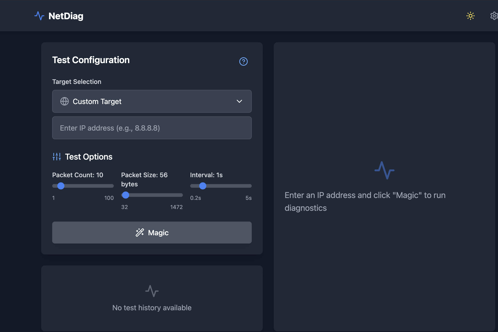

# NetDiag - Network Diagnostics Tool

A modern, web-based network diagnostics tool that provides detailed network path analysis using MTR (My TraceRoute). Built with React, TypeScript, and Tailwind CSS.



## Features

- 🌐 Network Path Visualization
- 📊 Detailed Metrics Display
- 🎯 Predefined Target Selection
- 📈 Real-time Progress Tracking
- 📝 Test History Management
- 🔄 IPv4 and IPv6 Support
- 📤 Raw MTR Export
- 🌙 Dark Mode Support

## Quick Start

```bash
# Install dependencies
npm install

# Start the development server
npm run dev
```

## Configuration

### Predefined Targets

Add or modify predefined targets in `src/config/targets.ts`:

```typescript
export const predefinedTargets: Target[] = [
  {
    name: 'Cloudflare DNS',
    ip: '1.1.1.1',
    description: 'Cloudflare\'s primary DNS server'
  },
  // Add more targets here
];
```

### Test Options

Customize test parameters:
- Packet Count: 1-100 packets
- Packet Size: 32-1472 bytes
- Interval: 0.2-5 seconds

## Architecture

- **Frontend**: React + TypeScript
- **Styling**: Tailwind CSS
- **Icons**: Lucide React
- **State Management**: React Hooks
- **Network Testing**: MTR (My TraceRoute)

## Key Components

- `DiagnosticDashboard`: Main application interface
- `TargetSelector`: IP target selection with presets
- `NetworkGraph`: Visual network path representation
- `MetricsDisplay`: Detailed network statistics
- `TestHistory`: Historical test results

## Network Test Results

Each test provides:
- Hop-by-hop analysis
- Latency measurements
- Packet loss statistics
- Jitter calculations
- ASN information
- Raw MTR output

## Development

```bash
# Run tests
npm run test

# Build for production
npm run build

# Preview production build
npm run preview
```

## Contributing

1. Fork the repository
2. Create a feature branch
3. Commit your changes
4. Push to the branch
5. Create a Pull Request

## License

MIT License - feel free to use this project for personal or commercial purposes.